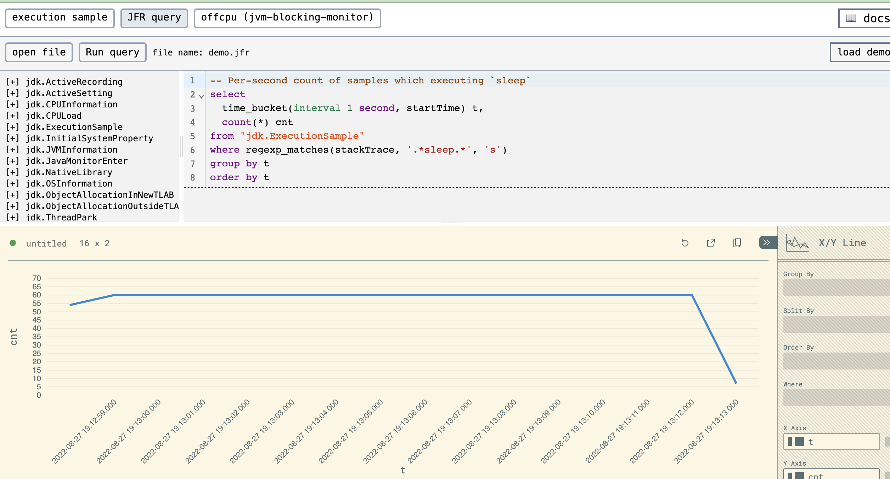

# DuckDB JFR extension

This is a custom extension for [DuckDB](https://duckdb.org/) to directly read Java Flight Recorder (JFR) files.

Please visit https://ocadaruma.github.io/jfrv/#/jfr-query for the working demo.



## Motivation

JFR format is a de-facto standard for JVM performance profiling which is adopted by various tools, including JDK Flight Recorder, async-profiler.

However, analyzing JFR files is not always easy because of the lack of query capabilities in the existing tools.

This extension provides a way to analyze JFR files with familiar SQL queries powered by DuckDB.

Furthermore, DuckDB can be compiled to WebAssembly and run in the browser, which enables us to visualize JFR data using web technologies.

This project is highly inspired by [jfr-analytics](https://github.com/moditect/jfr-analytics)

## Usage

### CLI

1. Download DuckDB binary from the official website
2. Download the extension binary from the [release page](https://github.com/ocadaruma/duckdb-jfr-extension/releases) for your platform
3. Load the extension then let's play with JFR!
 
```bash
$ /path/to/duckdb -unsigned
D load '/path/to/libduckdb_jfr_extension.so';
D call jfr_attach('/path/to/your.jfr');
D show tables;
┌─────────────────────────────────┐
│              name               │
│             varchar             │
├─────────────────────────────────┤
│ jdk.ActiveRecording             │
│ jdk.ActiveSetting               │
│ jdk.CPUInformation              │
│ jdk.CPULoad                     │
│ jdk.ExecutionSample             │
...
D select count(*) from "jdk.ExecutionSample";
```

### Java

1. Add `com.mayreh.duckdb:duckdb-jfr-jdbc:$VERSION` to your dependencies
2. Query JFR file through JDBC

```java
import com.mayreh.duckdb_jfr.DuckDBJfrConnection;

DuckDBJfrConnection conn = DuckDBJfrConnection.inMemoryConnection();
conn.attach(Paths.get("/path/to/your.jfr"));

Statement stmt = conn.connection().createStatement();
ResultSet rs = stmt.executeQuery("select count(*) from \"jdk.ExecutionSample\"");
```

## Development

### CLion

- Install [Bear](https://github.com/rizsotto/Bear)
- Generate `compile_commands.json` by `bear -- cargo build`
  * build.rs has to re-run for generation
  * You may need to clean the project or make some change to cpp sources if necessary
- Open the project in CLion
